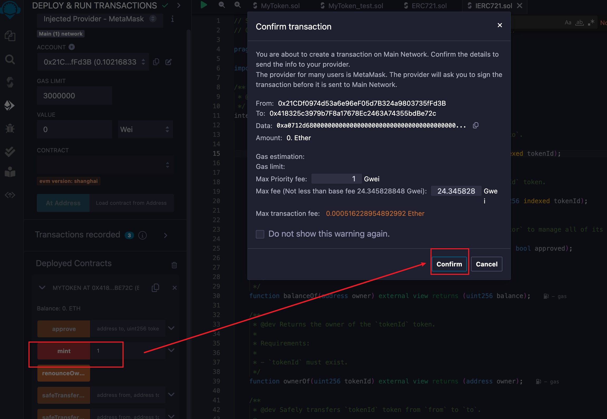

# Compile and Deploy Contract

## Compile

Click the `Solidity Compiler` icon in the icon panel to enter the compiler interface. The interface displays the basic configuration items of the compiler by default. Click the `Advanced Configurations` button to open the advanced configuration panel. In the `Advanced Configurations` menu, you can change the EVM version, enable the optimization function, and set the number of times the bytecode is expected to run during the contract lifecycle (default setting is 200 times). For more information about contract optimization, see [Solidity documentation on Optimizer](https://docs.soliditylang.org/en/latest/using-the-compiler.html#optimizer-options).

Open a file in the `File explorer` to compile. If multiple files are opened, make sure that the file you want to compile is selected in the editor.

There are three cases that trigger compilation:

- Use the shortcut key `control/command + s`
- Right-click the file in the `File explorer` and select the compilation option
- Click the `Compile` button

When the compilation is completed, there will be a green completion mark next to the `Solidity Compiler` icon, just like the one in the picture above. And `Remix` will create three JSON files for each compiled contract. These files can be seen in the `File explorer` plugin:

1. `artifacts/<contractName>.json`: Contains the link of `libraries`, `bytecode`, `deployedBytecode`, `gas estimation`, `identifiers` and `ABI`. It is used to associate the library address with the file.
2. `artifacts/<contractName_metadata>.json`: Contains the metadata output by `Solidity` compilation.
3. `artifacts/build-info/<dynamic_hash>.json`: Contains information about `solc` compiler version, compiler input and output.

Just like the picture below:

> `ABI` is a JSON array that describes the contract interface.

Click `ABI` to copy and export:

## Deploy

Click `Deploy&Run` to send the transaction to the current `ENVIRONMENT`.

Next, we will try to deploy the contract to the Goerli testnet through MetaMask. Please switch your MetaMask to the Goerli testnet (of course, you can also switch to other testnets you are used to using).

Click the drop-down box of `ENVIRONMENT`, you can see many options to choose from, we choose `Injected Provider - MetaMask`.

Then, `MetaMask` will pop up a window and prompt to connect it to `Remix`. After connecting `MetaMask` to `Remix`, the side panel will be updated to display the connected network and account. Deploying to the testnet also requires testnet tokens. You can find the corresponding testnet token faucet on the network for recharging.

Now, the wallet connection is complete, and you can start deploying the contract. Since a simple `ERC721` smart contract is being deployed, the default `Gas Limit` set by `Remix` is 3 million, which is enough, and there is no need to specify the value sent with the deployment. For this, you can perform the following steps to deploy the contract:

- Make sure that `ENVIRONMENT` is set to `Injected Provider - MetaMask`
- Make sure the connected account is the account you want to deploy
- Use the default `GAS LIMIT: 3000000`
- No need to adjust the set `VALUE: 0`
- Make sure the selected contract is `MyToken.sol`
- Click `Deploy`
- Click `transact` to send the deployment transaction
- `MetaMask` will pop up a window, click to confirm the deployment of the contract

After the transaction is deployed, you will see the details of the deployment transaction in the `Remix` terminal. In addition, the contract will appear below the `Deployed Contracts` section of the side panel. It is collapsed by default and can be expanded by clicking the small arrow.

You can try to expand it and then call `mint`, as shown in the figure below:

The call here will also trigger the MetaMask transaction confirmation pop-up window. After clicking confirm, you can initiate a transaction, which is the same as the process of initiating a transaction in DApp.

So far, we have successfully deployed a contract on the testnet. Next, we will try to call this contract in the DApp developed in the previous chapter.
