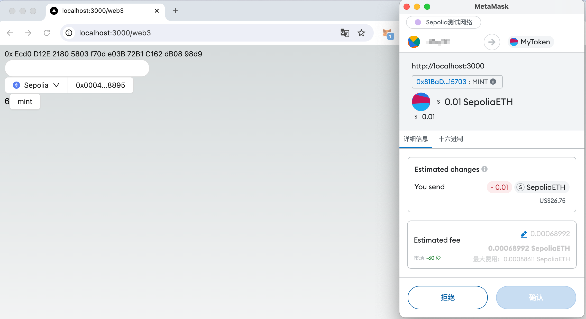

# 合约和 DApp 对接

这一节我们会将第二章开发的 DApp 和这一章部署的合约对接起来，完成一个完整的 DApp 开发任务。

## 对接 DApp

我们在上一章开发的 DApp 中，已经有了一个可以调用合约的页面，我们只需要将这个合约的地址填入到 DApp 中，就可以调用这个合约了。

除了地址以外，我们还需要切换到测试网。具体的代码如下：

```diff
import { createConfig, http, useReadContract, useWriteContract } from "wagmi";
- import { mainnet } from "wagmi/chains";
+ import { mainnet, sepolia } from "wagmi/chains";
import {
  WagmiWeb3ConfigProvider,
  MetaMask,
+  Sepolia,
} from "@ant-design/web3-wagmi";
import {
  Address,
  NFTCard,
  Connector,
  ConnectButton,
  useAccount,
} from "@ant-design/web3";
import { injected } from "wagmi/connectors";
import { Button, message } from "antd";
import { parseEther } from "viem";

const config = createConfig({
-  chains: [mainnet],
+  chains: [mainnet, sepolia],
  transports: {
     [mainnet.id]: http(),
+    [sepolia.id]: http(),
  },
  connectors: [
    injected({
      target: "metaMask",
    }),
  ],
});

- const CONTRACT_ADDRESS = "0xEcd0D12E21805803f70de03B72B1C162dB0898d9";
+ const CONTRACT_ADDRESS = "0x81BaD6F768947D7741c83d9EB9007e1569115703"; use your own contract address

const CallTest = () => {
  const { account } = useAccount();
  const result = useReadContract({
    abi: [
      {
        type: "function",
        name: "balanceOf",
        stateMutability: "view",
        inputs: [{ name: "account", type: "address" }],
        outputs: [{ type: "uint256" }],
      },
    ],
    address: CONTRACT_ADDRESS,
    functionName: "balanceOf",
    args: [account?.address as `0x${string}`],
  });
  const { data: hash, writeContract } = useWriteContract();
  const { isLoading: isConfirming, isSuccess: isConfirmed } =
    useWaitForTransactionReceipt({
      hash,
    });

  useEffect(() => {
    if (isConfirmed) {
      message.success("Mint Success");
      result.refetch();
    }
  }, [isConfirmed]);

  return (
    <div>
      {result.data?.toString()}
      <Button
        onClick={() => {
          writeContract(
            {
              abi: [
                {
                  type: "function",
                  name: "mint",
                  stateMutability: "payable",
                  inputs: [
                    {
                      internalType: "uint256",
                      name: "quantity",
                      type: "uint256",
                    },
                  ],
                  outputs: [],
                },
              ],
              address: CONTRACT_ADDRESS,
              functionName: "mint",
              args: [BigInt(1)],
              value: parseEther("0.01"),
            },
            {
              onError: (err) => {
                message.error(err.message);
              },
            }
          );
        }}
      >
        mint
      </Button>
      <Spin spinning={isConfirming} fullscreen />
    </div>
  );
};

export default function Web3() {
  return (
    <WagmiWeb3ConfigProvider
      config={config}
+      chains={[Sepolia]}
      wallets={[MetaMask()]}
    >
      <Address format address="0xEcd0D12E21805803f70de03B72B1C162dB0898d9" />
      <NFTCard
        address="0xEcd0D12E21805803f70de03B72B1C162dB0898d9"
        tokenId={641}
      />
      <Connector>
        <ConnectButton />
      </Connector>
      <CallTest />
    </WagmiWeb3ConfigProvider>
  );
};

```

然后在 DApp 页面中切换到 Sepolia 测试网，点击 `mint` 按钮后如果顺利会触发 MetaMask 的交易确认弹窗：



交易上链后，你会发现之前 `balanceOf` 的结果变成了 `1`，这代表你已经成功铸造了一个 NFT。当然，一个真正体验好的 DApp 会在智能合约中添加事件，在前端监听合约事件，然后自动更新结果。但是关于事件这部分内容我们就不在这个入门的课程中介绍了。

## 完整示例

下面是课程完整的示例：

<code src="./demos/dapp.tsx"></code>

你也可以参考 GitHub 项目源代码[https://github.com/ant-design/ant-design-web3-demo](https://github.com/ant-design/ant-design-web3-demo)。

至此，我们完成了本次课程的所有内容，希望你能够从中学到一些东西，谢谢大家！🎉
