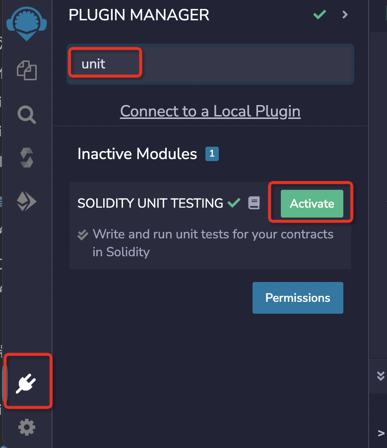
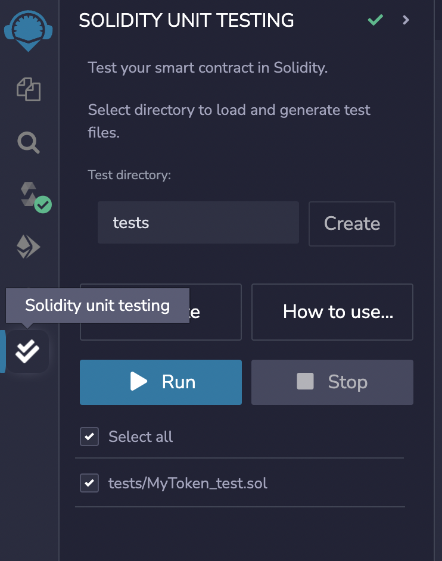

# 合约开发和测试

### 开发合约

[上篇文章](./contract-init.zh-CN.md) 中我们我们创建了一个带有`Mint` 功能的`ERC721` 的基础合约，接下来我们再继续了解下合约的功能编写和编译测试。

下面的代码我们简单实现一个 `tokenId` 自增的功能来取代我们每次`Mint` 时都要传入的`tokenId`，并把 `initialOwner` 设置为合约发行人。

1. 定义了一个名为`_nextTokenId` 类型为`uint256`合约私有变量`private`；
2. 在`safeMint` 方法中取消要求传入的类型为`uint256` 的`tokenId`，用我们定义的`_nextTokenId` 自增来代替它。

代码如下：

```solidity
// SPDX-License-Identifier: MIT
pragma solidity ^0.8.20;

import "@openzeppelin/contracts/token/ERC721/ERC721.sol";
import "@openzeppelin/contracts/access/Ownable.sol";

contract MyToken is ERC721, Ownable {
+    uint256 private _nextTokenId;

-    constructor(address initialOwner)
+    constructor()
        ERC721("MyToken", "MTK")
-        Ownable(initialOwner)
+        Ownable(msg.sender)
    {}

-    function safeMint(address to, uint256 tokenId) public onlyOwner {
+    function safeMint(address to) public onlyOwner {
+        uint256 tokenId = _nextTokenId++;
        _safeMint(to, tokenId);
    }
}
```

> private 是指只有部署前合约里才能调用的方法和变量，public 方法和变量则是所有人都可以访问的

### 测试合约

1. 单元测试插件

我们需要点击`Plugin mananer`图标在插件管理器搜索`unit`关键字，然后会出现搜索结果`SOLIDITY UNIT TESTING`，点击`Activate`，安装激活插件，如下图所示：



然后，`Solidity unit testing`的图标将出现在左侧图标栏中，单击该图标将在侧面板中加载插件。

成功加载后，插件看起来应该是这样子的：



2. 单元测试文件

Remix 注入了一个内置的 assert 库，可用于测试。您可以在此处查看库的文档 [这里](https://remix-ide.readthedocs.io/en/latest/assert_library.html)。  
除此之外，Remix 允许在测试文件中使用一些特殊函数，以使测试更具结构性。它们是：

- `beforeEach()` - 在每次测试之前运行
- `beforeAll()` - 在所有测试之前运行
- `afterEach()` - 在每次测试之后运行
- `afterAll()` - 在所有测试之后运行

我们的单元测试文件，在目录`tests/MyToken_test.sol`，这是因为我们选择的模板合约自动帮我们创建了测试合约。如果我们是新建的空白文件夹，那么就需要点击通过`Generate` 按钮来生成测试文件，如下图所示：


然后我们在`File explorer`中点击我们的测试文件`tests/MyToken_test.sol`，并编写以下测试内容：

1. `remix_tests.sol` 由 `Remix` 自动注入的；
2. `remix_accounts.sol` 为我们生成了测试账户的地址列表；
3. `../contracts/MyToken.sol` 引入了我们编写过的合约文件；
4. 在`beforeAll()` 里实例化我们的合约`MyToken`定义为`s`，并拿一个测试地址存起来`TestsAccounts.getAccount(0)`定义为`acc0`；
5. `testTokenNameAndSymbol()` 里验证了，实例化后的合约`name()`要获取到的值为`MyToken`，`symbol()` 的值为`MTK`；
6. 编写函数`safeMintOnce()`，调用我们的`safeMint()`方法，地址传入`acc0`，验证`acc0`地址，铸造过一次的 `balanceOf()`值应该为`1`;
7. 编写函数`safeMintAgain()`，再次调用我们的`safeMint()`方法，地址仍然传入`acc0`，验证`acc0`地址，铸造过两次次的 `balanceOf()`值应该为`2`;

`tests/MyToken_test.sol`文件代码如下：

```solidity
// SPDX-License-Identifier: GPL-3.0

pragma solidity >=0.8.0 <0.9.0;
import "remix_tests.sol";
import "remix_accounts.sol";
import "../contracts/MyToken.sol";

contract MyTokenTest {
    MyToken s;
    address acc0;
    function beforeAll () public {
        s = new MyToken();
        acc0 = TestsAccounts.getAccount(0);
    }

    function testTokenNameAndSymbol () public {
        Assert.equal(s.name(), "MyToken", "token name did not match");
        Assert.equal(s.symbol(), "MTK", "token symbol did not match");
    }
    function safeMintOnce() public {
        s.safeMint(acc0);
        Assert.equal(s.balanceOf(acc0), 1, "balance did not match");
    }
    function safeMintAgain() public {
        s.safeMint(acc0);
        Assert.equal(s.balanceOf(acc0), 2, "balance did not match");
    }
}
```

3. 运行单元测试

当我们完成编写测试后，选择文件并点击`Run` 以执行测试。执行将在单独的环境中运行。完成一个文件的执行后，将显示如下的测试摘要：


到这里，我们合约的单元测试就完成啦。

当然如果你更擅长使用 Chai 和 Mocha 测试的话，`Remix`也是支持的。

> Chai 是一个用于 Node.js 和浏览器的 BDD / TDD 断言库，可以与任何 JavaScript 测试框架愉快地配对使用。Mocha 是一个功能丰富的 JavaScript 测试框架，在 Node.js 和浏览器上运行，使异步测试变得简单而有趣。

只需要在工作区创建一个 `js` 文件，最好将其创建在 `scripts` 文件夹中。然后右键新建并编写好测试代码的 `js` 文件，点击`Run`。  
大概像这样：


点击 `Run` ，执行测试后结果会显示在终端上。

这里只是一个示例，提供了可以操作的方式和方法，如果你擅长这种方式的话，完全是支持的。

接下来我们会尝试，把我们编写好的合约文件`编译`并`部署上链` 。
