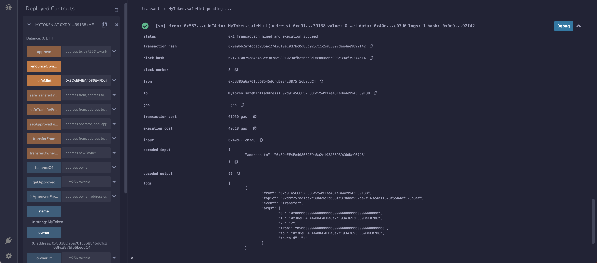

# 合约开发和测试

<!-- prettier-ignore -->
:::warning
课程编写中，欢迎给我们提建议或者直接提 PR。
:::

### 开发合约

OpenZeppelin 的模板合约所需版本为^0.8.20，因此编译器需要设置为 0.8.20 及以上的版本。  
我们简单实现一个 tokenId 自增的功能，并把 initialOwner 传为合约发行人

```
// SPDX-License-Identifier: MIT
pragma solidity ^0.8.20;

import "@openzeppelin/contracts/token/ERC721/ERC721.sol";
import "@openzeppelin/contracts/access/Ownable.sol";

contract MyToken is ERC721, Ownable {
    uint256 private _nextTokenId;

    constructor()
        ERC721("MyToken", "MTK")
        Ownable(msg.sender)
    {}

    function safeMint(address to) public onlyOwner {
        uint256 tokenId = _nextTokenId++;
        _safeMint(to, tokenId);
    }
}
```

### 测试合约

1. 我们选择 Remix 的 VM 环境 点击 Deploy

Solidity 编译器插件也允许您更改一些设置并应用编译器的高级配置，在 Advanced Configurations 菜单中，您可以更改 EVM 版本、启用优化功能，并设置预计在合约生命周期内运行字节码的次数（默认设置为 200 次）。有关合约优化的更多信息，请参考[Optimizer 上的 Solidity 文档](https://docs.soliditylang.org/en/latest/using-the-compiler.html#optimizer-options)。

> Remix 虚拟机带有 10 个账户，每个账户都有 100 个以太币。

在本示例中，无需额外的配置。要编译 MyToken.sol 合约，只需点击 Compile MyToken.sol 合约。如果编译成功，您可以在 Solidity compiler 插件旁的插件面板中出现绿色的完成标记。


2. 在更真实的区块链环境中，您需要批准交易，然后等待交易被打包和确认。然而，由于我们使用的是 Remix VM ，将立即执行。  
   终端将提供有关交易的信息。  
   新创建的实例显示在已部署合约部分。

可以愉快的测试合约方法啦  
返回值会显示在方法名按钮的正下方。


