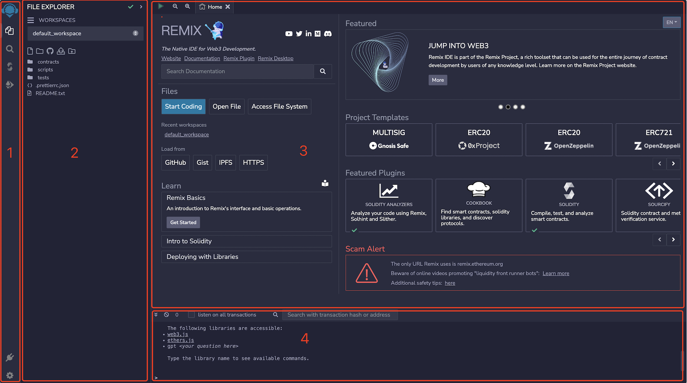
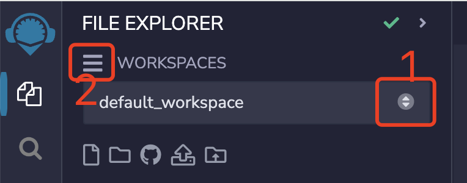

# 初始化合约

## 简述

本教程中，我们将使用 `Remix` 运行 `Solidity` 合约。

`Remix` 是以太坊官方推荐的智能合约集成开发环境（IDE），适合新手，提供了一个易于使用的界面，可以在浏览器中快速编写、编译和部署智能合约，无需在本地安装任何程序。

`Solidity` 是一门为实现`智能合约`而创建的高级编程语言。这门语言受到了 `C++`，`Python` 和 `JavaScript` 语言的影响，设计的目的是能在以太坊虚拟机（`EVM`）上运行。`Solidity` 是静态类型语言，支持继承、库和复杂的用户定义类型。

## 面板

进入[Remix](https://remix.ethereum.org)，我们可以看到如下图所示的界面：

像你看到的这样，`Remix` 由三个面板和一个终端组成。

1. 图标面板-点击可更改侧面板中显示的插件；
2. 侧面板–大多数插件（并非所有插件）的界面都在这里；
3. 主面板-用于编辑文件、大幅面工具和主页选项卡；
4. 终端-用于查看交易收据和各种日志。

### 图标面板

简单介绍下侧栏图标功能，后边我们用到了会更加详细的介绍讲解。  
`Home` 总是能打开主页面的，即使他被关闭掉了。  
`File explorer` 用于管理工作区和文件。  
`Search` 是一个全局搜索功能。  
`Solidity Compiler` 是合约编译器界面，界面中默认展示编译器的基础配置项和`Advanced Configurations` 按钮打开高级配置面板。  
`Deploy&Run` 是为了将交易发送到当前的`环境`中。  
`Debugger` 是一个调试器，调试交易的时候，调试器会显示合约的状态。  
`Plugin manager`是插件管理器，里边有非常多的插件可以选择安装。  
`Setting` 里会有一些基础的设置项，如`语言`，`主题`，`GitHub 访问令牌`，`常规设置`等。

## 工作区和文件

`Remix`中的`WORKSPACES` 是分隔项目的特殊文件夹。 一个工作区的文件不能导入或访问另一个不同工作区的文件。  
如下图所示，点击图标 1 可以切换不同的工作空间，图标 2 可以进行`Create`，`Clone`，`Rename`，`Download`，`Delete` 等等一系列的对于工作空间的操作。

 

## 创建

我们本次的教程是通过`Create` 按钮，进行演示的。  
当我们点击`Create` 时，会弹出`Create Workspace` 的弹窗，`Remix` 提供了以下模板：

- Basic
- Blank
- OpenZeppelin ERC20
- OpenZeppelin ERC721
- OpenZeppelin ERC1155
- 0xProject ERC20
- Gnosis MultiSig

当选择一个`OpenZeppelin` 库的 `ERC721` 模板时，可以添加额外的功能。

> [ERC721](https://eips.ethereum.org/EIPS/eip-721)（Ethereum Request for Comments 721），由 William Entriken、Dieter Shirley、Jacob Evans、Nastassia Sachs 在 2018 年 1 月提出，是一个在智能合约中实现代币 API 的非同质化代币标准。  
> [OpenZeppelin](https://docs.openzeppelin.com/contracts/5.x/)是一个用于安全智能合约开发的库，内置了很多常用合约的标准实现。

 

勾选上 `Mintable`，表示我们向模板合约里添加了`Mint` 的方法，然后点击 `OK`。  
到这里，我们的`Workspace` 就新建好了。如下图：

`.deps` 目录下是我们安装的 `@openzeppelin` 的 npm 包，这里边安装的是我们合约里引用的`合约模板` 以及合约模板里引用的`工具包`。  
`contracts` 下是放的自己编写的合约文件。  
`scripts` 文件夹下是自动生成的部署合约的脚本文件，执行这个下边的 js 文件也能实现部署合约。  
`tests` 里边自动编写了一些自动校验的测试文件。

`@openzeppelin` 向我们提供的`ERC721` 合约模板在`contracts/MyToken.sol` ，我们简单了解下这个合约的内容。

1. 第 1 行是注释，会写一下这个代码所用的软件许可（`license`），这里用的是`MIT license`。如果不写许可，编译时会警告（`warning`），但程序可以运行。`solidity` 的注释由`//` 开头，后面跟注释的内容（不会被程序运行）。
2. 第 2 行声明源文件所用的`solidity`版本，因为不同版本语法有差别。这行代码意思是源文件将不允许小于 `0.8.20` 版本或大于等于 `0.9.0` 的编译器编译（第二个条件由`^`提供）。`Solidity` 语句以分号（`;`）结尾。
3. 第 4-5 行是导入外部 `Solidity` 文件，导的 `Solidity` 文件和本身的 `Solidity` 文件相当于变成同一个 `Solidity` 合约。
4. 第 7 行是创建合约（`contract`），并声明合约的名字 `MyToken`，`is` 表示继承了引入的`ERC721`和`Ownable`合约。
5. 第 8-10 行是在`constructor` 中我们传入了继承来的合约定义好的参数，为`ERC721`传入 `token` 的 `name` 和 `symbol`，`Ownable` 传合约拥有者的地址。
6. 第 13-15 行是定义了`public` 对外开放的`safeMint` 方法，需要传入类型为`address`的`to`参数和类型为`uint256`的`tokenId`，方法里执行`ERC721.sol` 里引用的合约私有方法`_safeMint()`，并带入了参数`to` 和`tokenId`。

接下来我们就尝试，向合约模板里写入一些我们自定义的功能。
