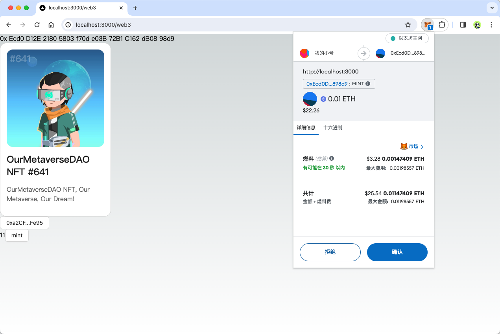

# 调用合约

## 简述

在这一篇课程中，将指导你在 DApp 中调用一个真实的合约。我们将以以太坊为例，调用一个 NFT 的合约 [0xEcd0D12E21805803f70de03B72B1C162dB0898d9](https://etherscan.io/address/0xEcd0D12E21805803f70de03B72B1C162dB0898d9)。

合约 [0xEcd0D12E21805803f70de03B72B1C162dB0898d9](https://etherscan.io/address/0xEcd0D12E21805803f70de03B72B1C162dB0898d9) 是一个 NFT 项目 [OurMetaverse](https://our-metaverse.xyz/) 的合约。它是一个符合 [ERC721](https://ethereum.org/zh/developers/docs/standards/tokens/erc-721) 标准的合约。我们尝试调用它的 `totalSupply` 方法来获取当前这个合约一共发行了多少个 NFT。

## 配置节点服务

因为我们只需要读取合约数据，并不需要修改合约数据。所以我们不需要向区块链发起交易，也就是说不需要消耗代币作为 [GAS](https://ethereum.org/zh/developers/docs/gas)。但是我们需要一个节点来帮助我们读取合约数据，在 Web3 生态中有很多提供节点服务的厂商，你可以选择自己喜欢的节点服务。这里以 [ZAN 的节点服务](https://zan.top/home/node-service)为例，指引你如何配置节点服务。

首先注册并登录 [https://zan.top](https://zan.top) 之后进入到节点服务的控制台 [https://zan.top/service/apikeys](https://zan.top/service/apikeys) 创建一个 Key，每个 Key 都有默认的免费额度，对于微型项目来说够用了，但是对于生产环境的项目来说，请结合实际情况购买节点服务。

创建成功后你会看到如下的页面：


选择以太坊主网的节点服务地址复制，复制后的地址添加到 wagmi 的 `http()` 方法中，如下：

```diff
const config = createConfig({
  chains: [mainnet],
  transports: {
-    [mainnet.id]: http(),
+    [mainnet.id]: http('https://api.zan.top/node/v1/eth/mainnet/{YourZANApiKey}'),
  },
  connectors: [
    injected({
      target: "metaMask",
    }),
  ],
});
```

上面代码中的 `YourZANApiKey` 需要替换成你自己的 Key。另外在实际的项目中，为了避免你的 Key 被滥用，建议你将 Key 放到后端服务中，然后通过后端服务来调用节点服务，或者在 ZAN 的控制台中设置域名白名单来降低被滥用的风险。当然，在教程中你也可以继续直接使用 `http()`，使用 wagmi 内置的默认的实验性的节点服务。

### 读的方式调用合约方法

配置好节点服务后，我们就可以开始调用合约了。我们使用 wagmi 提供的 [useReadContract](https://wagmi.sh/react/api/hooks/useReadContract) Hook 来读取合约数据。示例代码如下：

```diff
- import { createConfig, http } from "wagmi";
+ import { createConfig, http, useReadContract } from "wagmi";
import { mainnet } from "wagmi/chains";
import { WagmiWeb3ConfigProvider, MetaMask } from "@ant-design/web3-wagmi";
import { Address, NFTCard, Connector, ConnectButton } from "@ant-design/web3";
import { injected } from "wagmi/connectors";

const config = createConfig({
  chains: [mainnet],
  transports: {
    [mainnet.id]: http(),
  },
  connectors: [
    injected({
      target: "metaMask",
    }),
  ],
});

+ const CallTest = () => {
+   const result = useReadContract({
+     abi: [{
+       type: 'function',
+       name: 'totalApply',
+       stateMutability: 'view',
+       inputs: [],
+       outputs: [{ name: 'supply', type: 'uint256' }],
+     }],
+     address: '0xEcd0D12E21805803f70de03B72B1C162dB0898d9',
+     functionName: 'totalSupply',
+   });
+   return (
+     <div>{result.data?.toString()}</div>
+   );
+ }

export default () => {
  return (
    <WagmiWeb3ConfigProvider config={config} wallets={[MetaMask()]}>
      <Address format address="0xEcd0D12E21805803f70de03B72B1C162dB0898d9" />
      <NFTCard
        address="0x79fcdef22feed20eddacbb2587640e45491b757f"
        tokenId={8540}
      />
      <Connector>
        <ConnectButton />
      </Connector>
+      <CallTest />
    </WagmiWeb3ConfigProvider>
  );
};

```

参考以上的代码添加调用合约的 `totalSupply` 方法，我们新建了一个 `CallTest` 组件，然后在 `WagmiWeb3ConfigProvider` 内添加了这个组件。因为 `useReadContract` 必须在 `WagmiWeb3ConfigProvider` 内部才能正常工作，所以我们不能在 `export default () => {` 这一行代码下面直接使用 `useReadContract`。在实际的项目中 `WagmiWeb3ConfigProvider` 通常应该在你项目组件的最外层，这样确保你的项目所有组件中都可以正常使用相关的 Hooks。

代码中的 abi 字段定义了方法的类型，这样 wagmi 才能知道如何处理方法的入参和返回，把 JavaScript 中的对象转换的区块链的交易信息。通常 abi 都是通过合约代码自动生成的，我们会在下一章讲到这一部分。

### 写的方式调用合约方法

仅仅是读取合约还不够，一个真正的 DApp，肯定会涉及到向智能合约写入数据。向智能合约写入数据通常都是通过在区块链上执行智能合约的方法，方法执行过程中会改写合约中的数据。

接下来我们尝试调用下一本课程使用合约的 [mint](https://etherscan.io/address/0xEcd0D12E21805803f70de03B72B1C162dB0898d9#writeContract#F6) 方法，`mint` 方法并不是 ERC721 规范中的方法，它是该合约自行定义的。在本合约中，调用 `mint` 方法需要消耗 GAS 以及至少 `0.01ETH` 的费用来获取 NFT。

需要改动的代码如下：

```diff
- import { createConfig, http, useReadContract } from "wagmi";
+ import { createConfig, http, useReadContract, useWriteContract } from "wagmi";
+ import { Button, message } from "antd";
+ import { parseEther } from "viem";

// ...

const CallTest = () => {

// ...

  return (
    <div>
      {result.data?.toString()}
+      <Button
+        onClick={() => {
+          writeContract(
+            {
+              abi: [
+                {
+                  type: "function",
+                  name: "mint",
+                  stateMutability: "payable",
+                  inputs: [
+                    {
+                      internalType: "uint256",
+                      name: "quantity",
+                      type: "uint256",
+                    },
+                  ],
+                  outputs: [],
+                },
+              ],
+              address: "0xEcd0D12E21805803f70de03B72B1C162dB0898d9",
+              functionName: "mint",
+              args: [1],
+              value: parseEther("0.01"),
+            },
+            {
+              onSuccess: () => {
+                message.success("Mint Success");
+              },
+              onError: (err) => {
+                message.error(err.message);
+              },
+            }
+          );
+        }}
+      >
+        mint
+      </Button>
    </div>
  );
};

// ...

```

在上面的代码中，我们用到了 `viem` 这个库，它是 `wagmi` 底层依赖的一个库，你需要在项目中安装它：

```bash
npm i viem --save
```

这段代码中，我们实现了点击 `mint` 按钮后调用合约的 `mint` 方法，传入参数 `1`，在该合约的实现逻辑中，这代表要铸造一个 NFT。由于每个 NFT 铸造的价格是 `0.01 ETH`，所以我们还需要在交易中发送 `0.01 ETH` 的费用，这样才能成功铸造 NFT。所以上面会在调用合约中配置 `value: parseEther("0.01")`。在以太坊的合约方法执行中，合约并不能直接提取调用者的 ETH，所以我们需要在调用合约的时候主动发送 ETH 给合约，这是合约安全设计上的考虑。

合约调用成功和失败会有对应的提示，如果还未连接账号会抛出未连接账号的错误。所以你需要先点击我们在上一节课程中实现的连接按钮连接你的账户地址，如果你的账户有足够的 ETH，那么点击后会出现类似如下的授权弹窗：



点击 **拒绝** 后，不会执行合约调用，不会消耗你的任何 ETH。在下一章中，我们会指引你部署一个测试合约，在测试环境中体验完整的流程。当然如果你很富有，你也可以点击确认，这样就会执行合约调用，消耗你的 ETH，得到一个 NFT。

最终完整的代码如下：

<code src="./demos/call-contract.tsx"></code>
