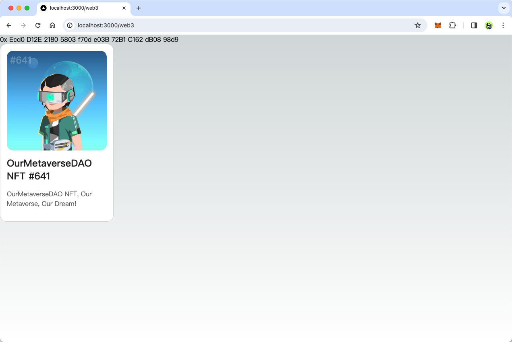
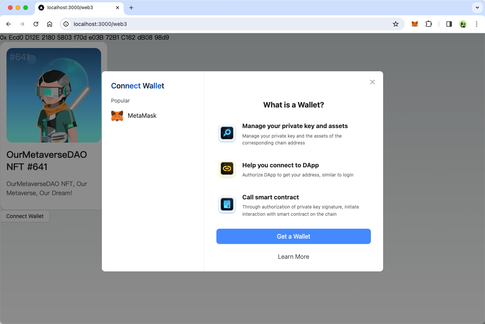

# 连接区块链

## 简述

在这一篇课程中，将指导你将 DApp 通过钱包和区块链建立连接。我们将以以太坊为例，连接上区块链并获取用户的账户信息。

## 安装依赖

首先，同[快速开始](../guide/quick-start.zh-CN.md)中文档指引的类似，我们需要安装一些依赖。在上一篇课程中，我们已经安装了 `antd` 和 `@ant-design/web3`，所以我们接下来只需要安装 `@ant-design/web3-wagmi` 和 `wagmi`。

```shell
npm i @ant-design/web3-wagmi wagmi viem @tanstack/react-query --save
```

`@ant-design/web3` 是一个 UI 组件库，它通过不同的[适配器](../guide/adapter.zh-CN.md)和不同的区块链连接。本课程中，我们主要基于的是[以太坊](https://ethereum.org/zh/)。对应的，我们也将使用[以太坊的适配器](../../packages/web3/src/ethereum/index.zh-CN.md)来实现课程的需求。

> [wagmi](https://wagmi.sh/) 是一个开源的服务以太坊的 React Hooks 库，Ant Design Web3 的适配器 `@ant-design/web3-wagmi` 基于它实现，在本课程的后面部分，如果没有特殊说明，那提到的适配器就是指 `@ant-design/web3-wagmi`。

## 配置适配器

适配器的配置直接采用 [wagmi 的官方配置](https://wagmi.sh/core/getting-started)，对于实际项目来说你通常需要配置 JSON RPC 的地址和各种钱包，在该课程中，我们会先采用最简单的配置，再逐步引导你了解你实际项目中所需要的配置。

首先，请继续编辑 `pages/web3.tsx` 文件，引入所需要的内容：

```diff
+ import { WagmiWeb3ConfigProvider } from '@ant-design/web3-wagmi';
import { Address } from "@ant-design/web3";

export default function Web3() {
  return (
    <Address format address="0xEcd0D12E21805803f70de03B72B1C162dB0898d9" />
  );
};
```

[WagmiWeb3ConfigProvider](https://web3.ant.design/components/wagmi-cn#wagmiweb3configproviderprops) 是基于 wagmi 封装的一个 Ant Design Web3 适配器，用于适配以太坊。它除了将 wagmi 的 API 适配为 Ant Design Web3 所需要的 API 之外，还做了一些易用性上的提升。你不需要再使用 wagmi 的 [createConfig](https://wagmi.sh/react/config) 来创建配置，它会自动帮你创建好 wagmi 的配置。当然，如果你有特殊需要，也可以[自定义配置](https://web3.ant.design/components/ethereum-cn#%E8%87%AA%E5%AE%9A%E4%B9%89-wagmi-%E9%85%8D%E7%BD%AE)，自定义的配置会覆盖 `WagmiWeb3ConfigProvider` 的自动生成的配置。

接着引入 `WagmiWeb3ConfigProvider`：

```diff
import { WagmiWeb3ConfigProvider } from "@ant-design/web3-wagmi";
import { Address } from "@ant-design/web3";

export default function Web3() {
  return (
+     <WagmiWeb3ConfigProvider>
      <div
        style={{
          height: "100vh",
          padding: 64,
        }}
      >
        <Address format address="0xEcd0D12E21805803f70de03B72B1C162dB0898d9" />
      </div>
+    </WagmiWeb3ConfigProvider>
  );
};

```

这样，我们就完成了 wagmi 的基础配置，接下来我们就可以通过 Ant Design Web3 的组件来获取链上的数据了。

我们试一试使用 [NFTCard](../../packages/web3/src/nft-card/index.zh-CN.md) 组件：

```diff
import { WagmiWeb3ConfigProvider } from "@ant-design/web3-wagmi";
- import { Address } from "@ant-design/web3";
+ import { Address, NFTCard } from "@ant-design/web3";

const config = createConfig({
  chains: [mainnet],
  transports: {
    [mainnet.id]: http(),
  },
});

export default function Web3() {
  return (
    <WagmiWeb3ConfigProvider>
      <div
        style={{
          height: "100vh",
          padding: 64,
        }}
      >
         <Address format address="0xEcd0D12E21805803f70de03B72B1C162dB0898d9" />
+        <NFTCard address="0xEcd0D12E21805803f70de03B72B1C162dB0898d9" tokenId={641} />
      </div>
    </WagmiWeb3ConfigProvider>
  );
};
```

`NFTCard` 组件会从 [0xEcd0D12E21805803f70de03B72B1C162dB0898d9](https://etherscan.io/address/0xEcd0D12E21805803f70de03B72B1C162dB0898d9) NFT 合约中获取 tokenId 为 641 的 NFT 信息，然后展示在页面上。

效果如下：



如果没有显示出来，那么请检查你的网络是否正常。

## 配置钱包

在上述步骤中，NFT 智能合约中的信息是公开的，无需连接用户钱包，即可通过节点服务（我们将在下一节详细介绍节点服务）直接获取。但是，如果我们希望获取用户的钱包地址，则需要与用户的钱包建立连接。

我们以 [MetaMask](https://metamask.io/) 为例，看一下如何配置钱包。另外我们配置了 `eip6963` 的 `autoAddInjectedWallets` 为 `true`，这样会自动添加你的浏览器安装的钱包。

```diff
- import { WagmiWeb3ConfigProvider } from "@ant-design/web3-wagmi";
+ import { WagmiWeb3ConfigProvider, MetaMask } from "@ant-design/web3-wagmi";
- import { Address, NFTCard } from "@ant-design/web3";
+ import { Address, NFTCard, Connector, ConnectButton } from "@ant-design/web3";

export default function Web3() {
  return (
-   <WagmiWeb3ConfigProvider config={config}>
+    <WagmiWeb3ConfigProvider
+      eip6963={{
+        autoAddInjectedWallets: true,
+      }}
+      wallets={[MetaMask()]}
+    >
      <Address format address="0xEcd0D12E21805803f70de03B72B1C162dB0898d9" />
      <NFTCard
        address="0xEcd0D12E21805803f70de03B72B1C162dB0898d9"
        tokenId={641}
      />
+       <Connector>
+         <ConnectButton />
+       </Connector>
    </WagmiWeb3ConfigProvider>
  );
};

```

最终完整的代码如下：

<code src="./demos/connect.tsx"></code>

可以得到如下的效果：



你可以尝试参考[这篇文档](../../packages/web3/src/ethereum/index.zh-CN.md#添加更多钱包)配置支持更多钱包。
